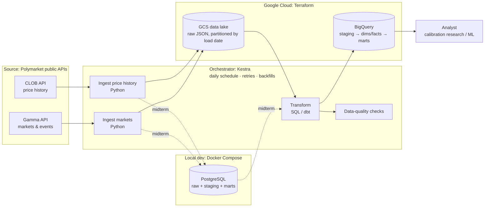

# Polymarket Calibration Pipeline

**DENG HS26 · Team 04 · Yazdan Musa & Dániel Polgár**

An end-to-end batch data pipeline that ingests resolved Polymarket prediction markets and their price history and builds curated BigQuery tables for **calibration research**.

---

## 1. Problem and use case

**Question:** When a prediction market prices an event at 70%, does that event actually happen about 70% of the time?

A perfectly calibrated market has observed outcome frequencies equal to its implied probabilities. Deviations show *where* markets are biased. Examples are the favourite-longshot bias (overpricing unlikely outcomes), category effects (politics vs. crypto vs. economics) and horizon effects (30 days vs. 1 day before close).

**End user:** An analyst or researcher studying prediction-market efficiency and bias.

**Data product:**
1. **`fct_market_snapshot`**: one row per resolved market per horizon (30, 7 and 1 days before close). It holds the implied probability at that point and the actual outcome. This is the core table for calibration analysis and optional ML modelling (predicting resolution).
2. **`mart_calibration_summary`**: calibration by probability bucket × category × horizon (market count, mean implied probability, observed frequency, Brier score).
3. Supporting dimension and fact tables (see [Data model](#5-data-model-planned)).

**Example analyst questions**
- Are politics markets better calibrated than crypto markets?
- Does calibration improve as close approaches (30d → 7d → 1d)?
- Are low-probability outcomes (< 10%) systematically overpriced?
- Is calibration better for high-volume markets?

---

## 2. Data source

| Property | Details |
|---|---|
| **Provider** | [Polymarket](https://polymarket.com), a blockchain-based prediction market |
| **Access** | Public REST APIs. No authentication or API key is required. |
| **Gamma API** | `https://gamma-api.polymarket.com`: market and event metadata, categories/tags, volume, dates, resolution status and final outcome prices (`/markets`, `/events`) |
| **CLOB API** | `https://clob.polymarket.com`: historical price series per outcome token (`/prices-history?market=<token_id>&interval=max&fidelity=1440`) |
| **Format** | JSON. Some fields (`outcomes`, `outcomePrices`, `clobTokenIds`) are JSON-encoded strings inside JSON. |
| **Update frequency** | Markets resolve continuously. We only need **closed** markets, so a **daily** batch is sufficient. |
| **Volume (estimate)** | Thousands of closed markets per year. After filtering, we expect a few thousand markets × ~30 to 365 daily price points, which is low millions of rows at most. |
| **Licence / terms** | Public data. We respect rate limits and do not redistribute raw dumps in this repo. |

### Example records

Gamma `/markets` (trimmed):
```json
{
  "id": "253591",
  "question": "Will Donald Trump win the 2024 US Presidential Election?",
  "conditionId": "0xdd22...0917",
  "startDate": "2024-01-04T22:58:00Z",
  "endDate": "2024-11-05T12:00:00Z",
  "closedTime": "2024-11-06 15:17:41+00",
  "closed": true,
  "outcomes": "[\"Yes\", \"No\"]",
  "outcomePrices": "[\"1\", \"0\"]",
  "volumeNum": 1531479284.50,
  "clobTokenIds": "[\"2174...6455\", \"4833...5732\"]",
  "umaResolutionStatus": "resolved",
  "events": [{ "id": "903193", "slug": "presidential-election-winner-2024", "...": "..." }]
}
```

CLOB `/prices-history`:
```json
{ "history": [ { "t": 1704412803, "p": 0.5 }, { "t": 1704499202, "p": 0.405 } ] }
```

### Data-quality risks

| Risk | Mitigation |
|---|---|
| Nested JSON-encoded string fields | Parse explicitly in staging and validate the array lengths |
| Ambiguous or disputed resolutions (e.g. 50/50 payouts, `umaResolutionStatus` ≠ `resolved`) | Keep only markets with a clean 0/1 outcome and flag the rest |
| Missing or sparse price history (illiquid markets) | Minimum-volume filter. The snapshot uses the last known price at or before the horizon, with a max staleness threshold. |
| `endDate` ≠ actual `closedTime` (early resolution) | Define horizons relative to `closedTime`, document the choice, and keep both |
| Inconsistent categories/tags | Map tags to a small controlled category set (politics, crypto, economics, other) |
| Multi-outcome events (neg-risk groups) | Treat each binary Yes/No market as its own row and keep `event_id` for grouping |
| Price-history API quirks (e.g. explicit `startTs`/`endTs` windows can return empty results) | Use `interval=max` with daily fidelity and filter the time range downstream |
| API rate limits and transient errors | Retries with exponential backoff, request throttling and idempotent writes |
| Survivorship / look-ahead bias | Snapshot prices only use data strictly before the horizon timestamp |

---

## 3. Scope

- **Markets:** closed, binary (Yes/No) markets
- **Time window:** markets closed in the **last 12 months** (backfill), then incremental daily loads
- **Filters:** above a minimum volume (initially **$10k**, tunable) and open for **≥ 30 days** (so every horizon exists)
- **Categories:** mainly **politics, crypto, economics**. **Sports are excluded** at first (very high count, short-lived markets).
- **Horizons:** 30, 7 and 1 days before close

---

## 4. Architecture v0.1



**Pipeline steps**
1. **Ingest markets:** page through Gamma `/markets` for closed markets in the load window, apply scope filters, and write the raw JSON pages.
2. **Ingest price history:** for each new market, fetch the daily price series of the **Yes** token from the CLOB API and write the raw JSON.
3. **Land raw data:** midterm: PostgreSQL (`raw` schema, JSONB). Final: GCS at `gs://<bucket>/raw/{markets|prices}/load_date=YYYY-MM-DD/…`, written directly without depending on local storage.
4. **Transform:** parse, type and deduplicate in staging, then build dimensions, facts, snapshots and marts.
5. **Quality checks:** uniqueness, not-null, accepted values, price in [0, 1], and horizon timestamps before close.
6. **Serve:** curated BigQuery tables queried by the analyst.

**Ingestion strategy**
- **Initial backfill:** 12 months of closed markets
- **Daily incremental:** markets whose `closedTime` falls in the previous day (high-water mark on `closedTime`). Price history is fetched only for new markets, because resolved markets no longer change.
- **Idempotency:** raw data is partitioned by load date. Reloads overwrite a partition, and downstream tables are rebuilt with `MERGE` on `market_id`, so reruns do not create duplicates.
- **Failure behaviour:** per-request retries with backoff. A failed market is logged and retried on the next run without blocking the whole batch.

### Technology choices

| Layer | Local (midterm) | Cloud (final) |
|---|---|---|
| Ingestion | Python (`requests`) | Python (`requests`) |
| Data lake | – | Google Cloud Storage |
| Storage / warehouse | PostgreSQL | BigQuery |
| Transformation | SQL | dbt + BigQuery |
| Orchestration | Kestra | Kestra |
| Infrastructure | Docker Compose | Terraform (GCS bucket, BigQuery datasets, service account) |

---

## 5. Data model (planned)

| Table | Grain (one row = …) | Purpose |
|---|---|---|
| `dim_event` | one Polymarket event | Groups related markets, holds category and tags |
| `dim_market` | one binary market | Question, dates, volume, category, resolved outcome (0/1) |
| `fct_price_daily` | one market × one day | Daily Yes-token price (implied probability) |
| `fct_market_snapshot` | one resolved market × one horizon (30/7/1 days) | Implied probability at the horizon plus the outcome. Core table for calibration and ML. |
| `mart_calibration_summary` | one category × horizon × probability bucket | Market count, avg. implied probability, observed frequency, Brier score |

Partitioning and clustering (final): `fct_price_daily` is partitioned by `price_date` and clustered by `market_id`. `fct_market_snapshot` is clustered by `category, horizon_days`.

---

## 6. Project plan / backlog

| Week | Milestone | Tasks |
|---|---|---|
| 3 (01.10) | **Initial pitch** | README, use case, data-source analysis, Architecture v0.1, backlog |
| 4 | | Python ingestion for Gamma + CLOB, PostgreSQL schema, Docker Compose |
| 5 | | Kestra flow: schedule, retries, backfill by date parameter |
| 6 (22.10) | **Midterm submission** | First transformation (`fct_market_snapshot` in Postgres), Architecture v0.2, setup and verification docs |
| 8–10 | | Terraform (GCS, BigQuery, service account), cloud ingestion direct to GCS |
| 11 | | BigQuery external/native tables, partitioning and clustering |
| 12 | | dbt models (staging → dims/facts → marts), tests, docs |
| 13 (10.12) | **Final submission** | Data-quality checks, safe reruns, final architecture, verification queries, known limitations |

---

## 7. Anticipated challenges

- Correctly determining the **resolved outcome** and handling disputed or voided markets
- Choosing a **consistent close timestamp** for horizon calculation
- **Sparse prices** for low-liquidity markets at the 30-day horizon
- **Category mapping** from free-form tags
- **Rate limits** during the initial 12-month backfill (thousands of price-history requests)
- **Sample size:** the calibration buckets need enough markets per category × horizon to be meaningful

---

## 8. Repository structure (planned)

```
.
├── README.md
├── docs/               # architecture diagrams (v0.1, v0.2, final)
├── ingestion/          # Python ingestion modules
├── orchestration/      # Kestra flows
├── transformations/    # SQL / dbt models
├── terraform/          # GCP infrastructure
├── docker-compose.yml
└── .env.example        # configuration template (no secrets committed)
```

## 9. Setup and verification

*To be added for the midterm milestone.*

## 10. Known limitations

- Markets are a single platform's view (Polymarket only). Results may not generalise to other prediction markets.
- Calibration is measured on daily closing prices, not intraday prices.
- Sports markets are excluded in the first version.
